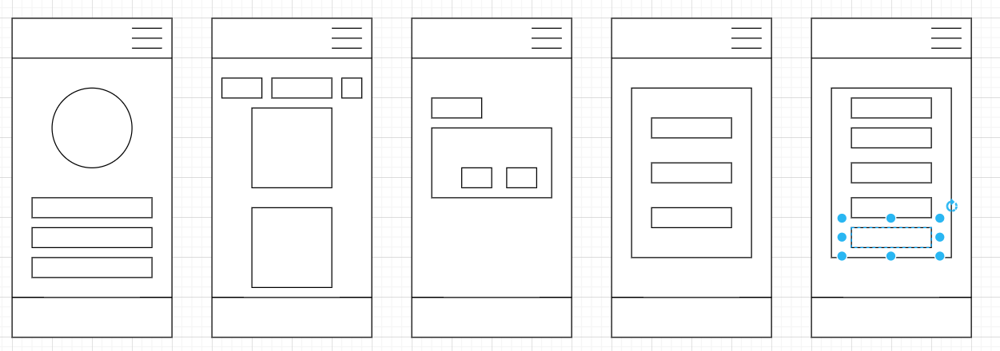
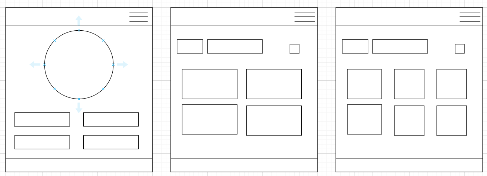
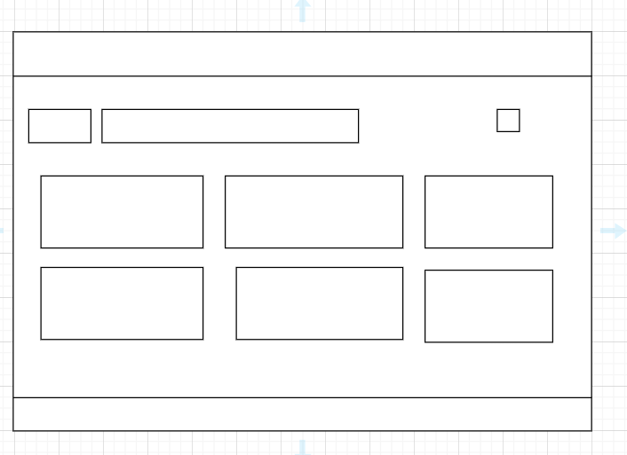
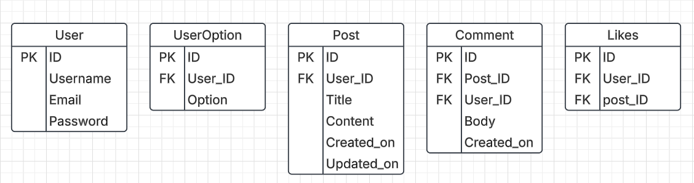
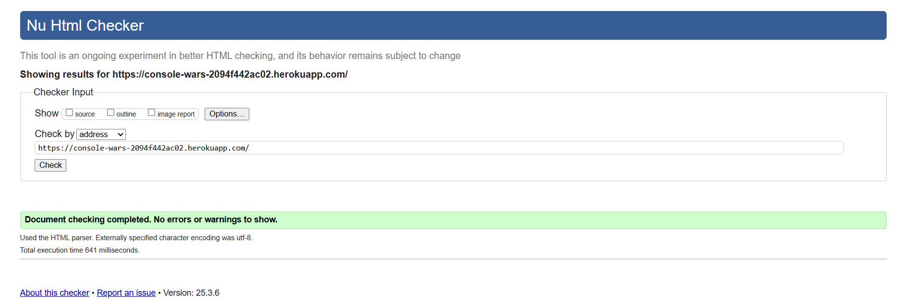
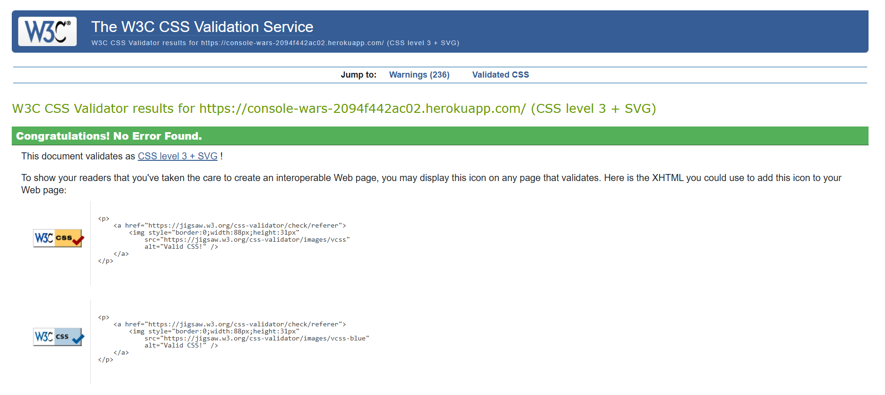
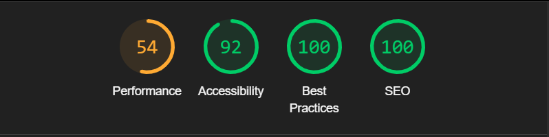
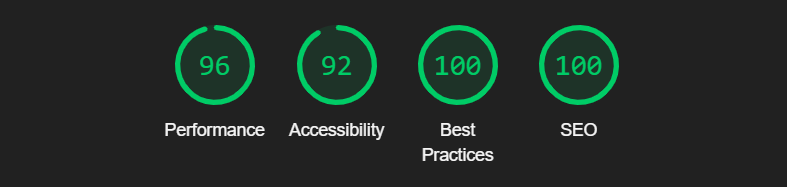

# CodeWars

## Overview
CodeWars is a community-driven platform designed to bring gaming enthusiasts together. The platform allows users to share their thoughts, engage in discussions, and express their preferences for different gaming platforms, such as Nintendo Switch, Xbox, PC, and PlayStation. 

The project aims to:
- Provide a space for users to create, view, and interact with posts about their favorite gaming platforms.
- Enable users to like posts, comment on them, and engage in meaningful discussions.
- Offer insights into user preferences through visual data representation, such as pie charts showing platform popularity.

By fostering a collaborative and inclusive environment, CodeWars encourages users to connect over their shared passion for gaming while ensuring accessibility and usability for all.

## UX Design Process

Here is project kanban board to keep track of all the user stories to becompleted and checked off.
<a href = "https://github.com/users/b0bengo/projects/9/views/1">Link to User Stories in GitHub Projects:</a>

### Wireframes: 

Mobile Wireframe Home page, Post page,Your Post page, Log in and Register Page(From left to Right):

Tablet Wireframe:

Desktop Wireframe:

To keep simplicity of the project, wireframes were drawn simliraly with differences being in filling space as the device size increases. For example, the home pages most liked section changes from a 4x1 area into a 2x2 and the post list changes from 6x1 to to 3x2 to 2x3 or the log in and register pages being the same.
  
Basic website needs such as a navbar was imperative in design to allow users to easily navigate throughout the website, whether it be to log in or register, with little difficulty regardless of the device size. Moreover, the design was kept simple considering smaller devices first and upscaling, the use of pagination helped dramaticaly because it ensured that users would not be stuck scrolling consistently.

Each page had its purpose, with the 'Home' screen focusing on on giving users information without having to commit to logging in, casual browsing. A pie chart was selected because it was easier to compare with larger shapes denoting more registered users choosing that specific console. Below the pie chart is the four most liked posts from each console, for the target audience to see what people enjoy talking about the most.

To get a broader view of what others say the user can go to the 'Posts' page where every post made by a registered user is visible, however there is a prompt that clearly states to engage more than reading the user must login or register for that matter.

Finally, users who do have an account can login and edit or simply view their own posts in the 'Your Posts' page. Also, they have the ability to comment or like other posts.

### Design Rationale 

 - **Layout**:  
    The layout was designed with simplicity and usability in mind. A clean and intuitive structure ensures users can easily navigate the website. The use of Bootstrap's grid system provides a responsive design that adapts seamlessly to different screen sizes, ensuring accessibility on desktops, tablets, and mobile devices.

  - **Color Scheme**:  
    The color scheme was chosen to reflect the vibrant and dynamic nature of the gaming community. Each gaming platform (e.g., Nintendo Switch, Xbox, PC, PlayStation) is represented by its signature color, making it easy for users to identify and engage with their preferred platform.

  - **Typography**:  
    A modern sans-serif font, "Roboto," was selected for its readability and clean appearance. Font sizes and weights were carefully chosen to ensure clarity and visual hierarchy across all devices.

  - **Accessibility**:  
    Accessibility was a key consideration throughout the design process:
    - High contrast between text and background colors ensures readability for users with visual impairments.
    - All interactive elements, such as buttons and links, are keyboard-navigable.
    - Alt text is provided for all images, ensuring compatibility with screen readers.
    - The website adheres to WCAG (Web Content Accessibility Guidelines) to provide an inclusive experience for all users.

  - **User-Centric Design**:  
    The design prioritizes user engagement and personalization:
    - A dynamic pie chart on the home page visually represents user preferences, making data easy to interpret.
    - The "Most Liked Posts by Category" section highlights trending discussions, encouraging users to explore popular content.
    - A dedicated "Your Posts" page allows users to manage their contributions, fostering a sense of ownership and community.

## Key Features

In order to provide good platform for users to build a community the following questions where raised:
- How can we keep users engaged?
- How can we personalize the website for each user?

<table>
  <tr>
    <th>Feature</th>
    <th>Function</th>
    <th>Result</th>
  </tr>

  <tr>
    <td>User Registration and Authentication</td>
    <td>Allows users to register, log in, and log out securely.</td>
    <td>Provides a personalized experience by enabling users to create posts, like posts, and leave comments.</td>
  </tr>

  <tr>
    <td>Post Creation and Management</td>
    <td>Users can create, edit, and delete posts about their favorite gaming platforms.</td>
    <td>Empowers users to share their thoughts and engage with the community.</td>
  </tr>

  <tr>
    <td>Commenting System:</td>
    <td>Users can leave comments on posts and delete their own comments.</td>
    <td>Facilitates discussions and interactions between users.</td>
  </tr>

  <tr>
    <td>Like/Unlike Posts</td>
    <td>Users can like or unlike posts</td>
    <td>Allows users to express their preferences and engage with content they enjoy.</td>
  </tr>

  <tr>
    <td>Most Liked Posts by Category:</td>
    <td>Displays the most liked posts for each gaming platform</td>
    <td>Highlights popular content, making it easier for users to discover trending discussions.</td>
  </tr>

  <tr>
    <td>User Dashboard</td>
    <td>Provides a dedicated section for users to view and manage their own posts.</td>
    <td>Offers a centralized location for users to keep track of their contributions.</td>
  </tr>

  <tr>
    <td>Dynamic Pie Chart</td>
    <td>Displays a visual representation of user preferences for different gaming platforms.</td>
    <td>Provides insights into community trends and preferences.</td>
  </tr>

  <tr>
    <td>Responsive Design</td>
    <td>Ensures the website is fully functional and visually appealing on all devices (desktop, tablet, mobile).</td>
    <td>Enhances accessibility and usability for all users.</td>
  </tr>
</table>

## Entity Relationship Diagram (ERD)

- User and UserOption:
  - One-to-One: Each user has one console preference stored in the UserOption model.

- User and Post:
  - One-to-Many: A user can create multiple posts, but each post belongs to one user.

- Post and Comment:
  - One-to-Many: A post can have multiple comments, but each comment belongs to one post.

- User and Comment:
  - One-to-Many: A user can create multiple comments, but each comment belongs to one user.

- User and Post (Likes):
  - Many-to-Many: A user can like multiple posts, and a post can be liked by multiple users.

## Deployment

The platform of choice to host this website was Heroku a cloud platform that simplifies application deployment and scaling.

Deployment can be summarised in the following phases: environment, configuration and version control.

A virtual environment was created to .... and dependecies needed to achieve the desired project where recorded in a `requirements.txt` file. There where two files needed to setup the envronment: `runtime.txt` to specify Python version and a `Procfile` to specify the application type and entry point.

Heroku also needed to be configured so that important parameters such as SECRET_KEY and DATABASE_URL are setup

Finally, once version control using git was implemented, the project can be deployed using Heroku deployment section. It was very important to check between the deployment version and the deployed version frequently so any disrepencies can be adjusted. Moreover, DEBUG mode is set to False during production so that sensitive data such as the SECRET_KEY and database credentials cannot be obtained.

## AI Implementation and Orchestration

### Use Cases and Reflections:

Despite AI tools rapidly aiding the ease of reptitive tasks, there are times where prompts may result in a change of code or code that need further explanation therefore requiring more care reading before applying changes. Nevertheless, there were still times where AI provided helpful suggestions on how to approach certain ideas as well gaps in knowledge in other areas. This was achieved through, for example,  ghost text, where by commenting the purpose of the next line of code AI can generate the nexts bits of code to achieve the comment.

## Test and Checking

### WC3 Checker

- HTML Checker

- CSS Checker

### Lighthouse

- Mobile

- Desktop

Decrease in performance was to be expected mainly due to the animation and loading of the pie chart and its constant querying to determine if any updates are to be made. 

### Testing Summary
- Manual Testing:
It was imperative to try out the website manually by creating a series of accounts and interacting with all of them. This involved: registering to view the updating piechart, liking specific posts to observe if the "most liked post" changed, liking/unliking posts of choice and testing the CRUD functionality of posts. In addition to this, Google Developer tools were used too observe the design on different device to ensure responsiveness.

- Automated Testing: 
This was to take the testing further to secure a robost framework. Using AI and Django's TestCase framework, the form and views in each app could be tested to the fullest ensuring any errors could be corrected.
  
## Future Enhancements

There were several improvements to be made towards the project such as:
- The ccompletion of the 'Fun Facts' page desgined for the casual browsers to view the highest selling console in each continent or random facts about the consoles themselves

- A user select in the home page to chose what type of graph to view the percentage of each console user registered

